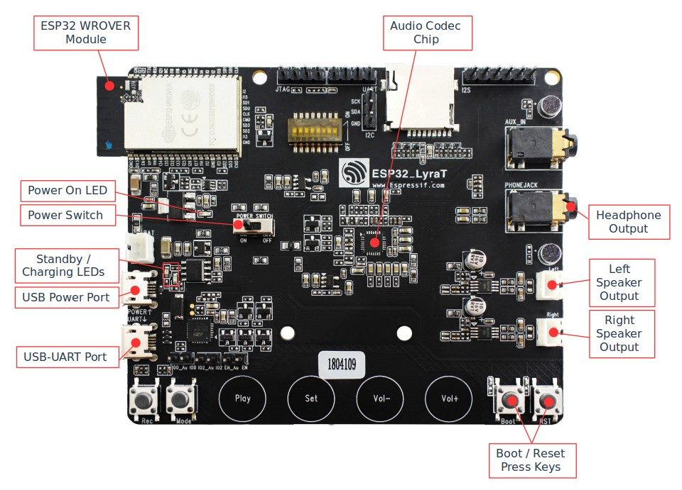
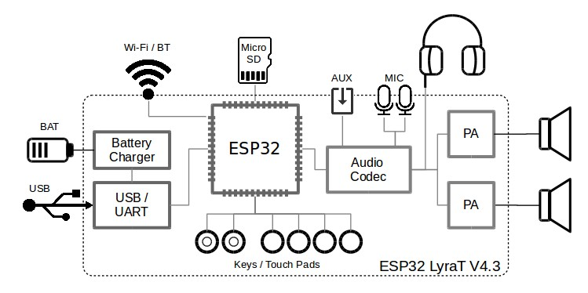
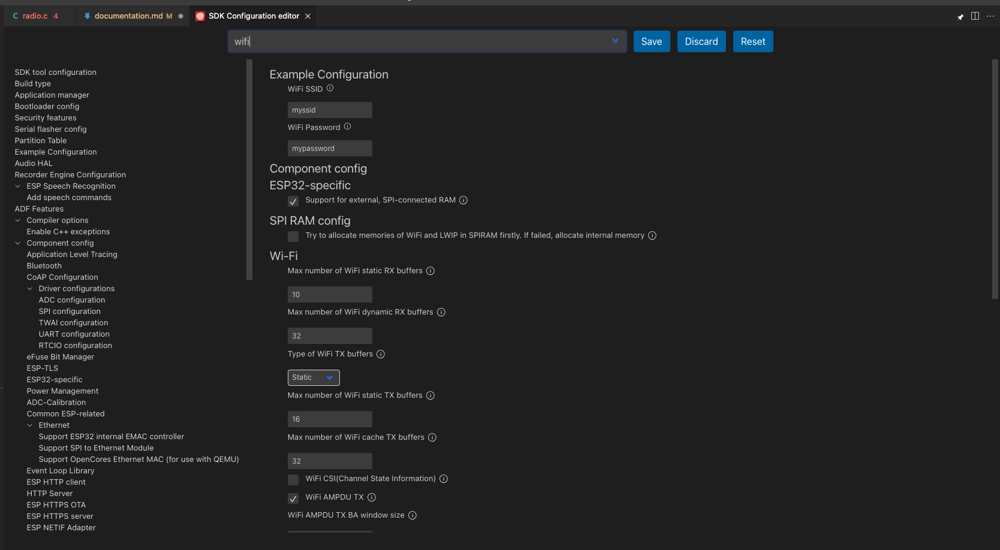
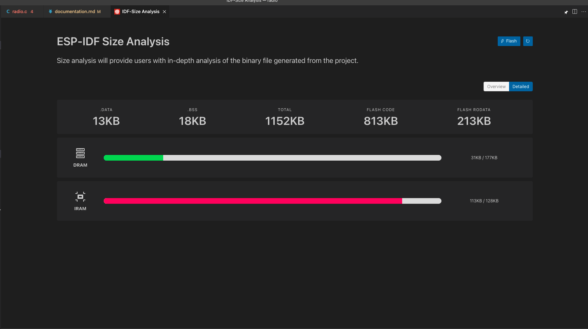
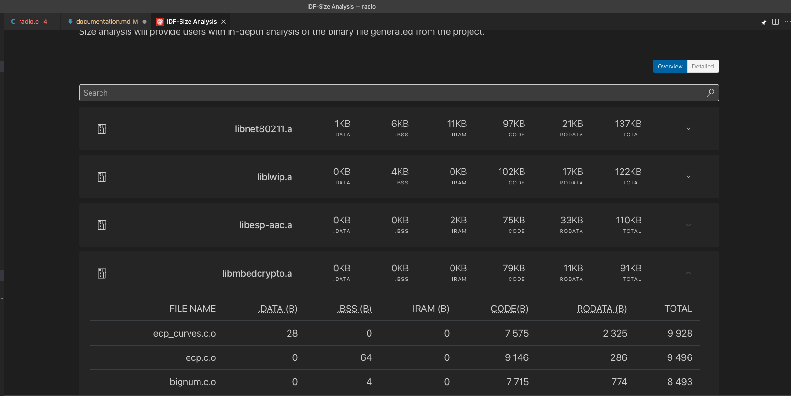
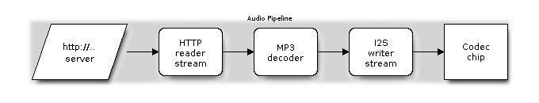

<div style="text-align: right"> Stanisław Denkowski, Kacper Karoń 09.06.2021</div>

# Dokumentacja projektu radia internetowego na platformie ESP32 LyraT

## 1. Schemat urządzenia i fizyczne środowisko


*Powyższe zdjęcie zostało skopiowane z oficjalnej dokumentacji płytki: https://docs.espressif.com/projects/esp-adf/en/latest/get-started/get-started-esp32-lyrat.html* 

*Powyższy diagram został skopiowany z oficjalnej dokumentacji płytki: https://docs.espressif.com/projects/esp-adf/en/latest/get-started/get-started-esp32-lyrat.html*

Wykorzysujemy:

- ESP32-LyraT V4.3
- Access Point Wi-Fi
- dodatkowe głośniki dołączone do płytki
- zasilanie z portu USB komputera

## 2. Zrealizowane funkcjonalności

Celem projektu było stworzenie radia internetowego. Gotowy produkt ma następujące funkcjonalności:
- lista dostępnych stacji jest zawarta w pliku źródłowym (poprzez adresy URL)
  - działają zarówno strony streamujące plik, jak i parsowanie playlist (zakodowanych np. w m3u8)
- obsługiwane jest wiele formatów kodowania:
  - dekoder "auto" automatycznie rozpoznaje pliki mp3 i aac 
  - dekoder aac jest ustawiony ręcznie dla plików mp4a (niestety dekoder "auto" miał problem z odpowiednim rozpoznawaniem tego formatu)
- możliwość przechodzenia za pomocą przycisku SET cylkicznie po liście stacji
- możliwość regulacji głośności za pomocą przycisków VOL+, VOL-
- możliwość przerywania i wznawiania odtwarzania radia za pomocą przycisku PLAY
- kończenie pracy radia za pomocą przycisku MODE

## 3. Stos technologiczny

- Platforma sprzętowa: ESP32-LyraT V4.3
- Język programowania: C
- IDE: Visual Studio Code + ESP-IDF oficjalny plugin
- Biblioteki: esp-idf + esp-adf

Możliwości oficjalnej wtyczki ESP-IDF do Visual Studio Code:
- Budowanie projektu.
- Czyszczenie projektu.
- Wybieranie portu na który należy wgrać program (Flash).
- Wgrywanie programu na płytkę - domyślnie JTAG, ale można wybrać UART.
- Monitorowanie portu, aby móc odczytywać komunikaty z płytki.
- Analiza rozmiaru plików binarnych pod względem wykorzystania ramu.
- Włączenie GUI w którym można zmieniać ustawienia projektu (dane Wi-Fi, rodzaj płytki itp.).
- Tworzenie nowego projektu, czy to z gotowego przykładu, który chcemy rozbudować, czy po prostu czystego projektu.
- Istnieje możliwość przeprowadzenia debugowania przez JTAG oraz wygenerowania core-dump, jednak ta opcja nie była wykorzystywana przy realizacji projektu https://github.com/espressif/vscode-esp-idf-extension/blob/master/docs/tutorial/debugging.md. 
- Kilka innych funkcji, które są opisane w oficjalnej dokumentacji https://docs.espressif.com/projects/esp-idf/en/latest/esp32/get-started/vscode-setup.html.

Oto naszym zdaniem dwa najciekawsze przykłady, wykorzystania GUI z plugina (mimo, że najczęściej używaliśmy build, flash i monitor).
- Ustawienia projektu zastosowane przy tworzeniu oprogramowania (obraz poglądowy)
  
- Analiza wykorzystywanej pamięci (obraz poglądowy)
  
  

## 4. Opis projektu
### 4.0 Nagłówki
Poniżej umieszczono listing kodu, w którym są załączane pliki nagłówkowe potrzebne do realizacji projektu. Wykomentowane linie demonstrują jak łatwo można załączać nowe dekodery.
```c
#include <string.h>
#include "freertos/FreeRTOS.h"
#include "freertos/task.h"
#include "freertos/event_groups.h"
#include "esp_log.h"
#include "esp_wifi.h"
#include "esp_decoder.h"
#include "nvs_flash.h"
#include "sdkconfig.h"
#include "audio_element.h"
#include "audio_pipeline.h"
#include "audio_event_iface.h"
#include "audio_common.h"
#include "http_stream.h"
#include "i2s_stream.h"
#include "aac_decoder.h"
// #include "mp3_decoder.h"
// #include "ogg_decoder.h"

#include "esp_peripherals.h"
#include "periph_wifi.h"
#include "periph_touch.h"
#include "periph_adc_button.h"
#include "periph_button.h"
#include "board.h"

#if __has_include("esp_idf_version.h")
#include "esp_idf_version.h"
#else
#define ESP_IDF_VERSION_VAL(major, minor, patch) 1
#endif

#if (ESP_IDF_VERSION >= ESP_IDF_VERSION_VAL(4, 1, 0))
#include "esp_netif.h"
#else
#include "tcpip_adapter.h"
#endif

static const char *TAG = "RADIO";
```

### 4.1 Lista obsługiwanych stacji
Poniżej przedstawiono listing, w którym definiujemy pomocniczą strukturę stacji oraz listę predefiniowanych stacji.
```c
typedef struct{
    char* name;
    char* decoder_name;
    char* uri;
} radio_station_t;

radio_station_t stations[] = {
    {
        .name = "station1",
        .decoder_name = "auto", // aac
        .uri = "https://streams.radiomast.io/a622d414-52a6-4426-b3b8-ed2a4dbb704b"
    },
    {
        .name = "station2",
        .decoder_name = "auto", // aac
        .uri = "http://open.ls.qingting.fm/live/274/64k.m3u8?format=aac"
    },
    // { OGG doesn't work :(
    //     .name = "station4",
    //     .decoder_name = "auto", // ogg
    //     .uri = "https://listen.moe/stream"
    // },
    {
        .name = "station3",
        .decoder_name = "auto", // mp3
        .uri = "http://musicbird.leanstream.co/JCB104-MP3"
    },
    {
        .name = "station4",
        .decoder_name = "auto", // aac
        .uri = "http://stream2.bbnradio.org:8000/chinese.aac"
    },
    {
        .name = "station5",
        .decoder_name = "aac", // mp4a
        .uri = "http://101.79.244.199:1935/cocotv/_definst_/CH00007/playlist.m3u8"
    },
    {
        .name = "station6",
        .decoder_name = "aac", // mp4a
        .uri = "http://sk.cri.cn/hyhq.m3u8"
    },
    {
        .name = "station7",
        .decoder_name = "auto", // mp3
        .uri = "http://musicbird.leanstream.co/JCB075-MP3"
    },
    {
        .name = "station8",
        .decoder_name = "auto", // mp3
        .uri = "https://musicbird.leanstream.co/JCB064-MP3"
    }
};

#define RADIOS_NUMBER (sizeof(stations) / sizeof(radio_station_t))
int current_ix = 0;
```

Daną stację opisuje specjalna struktura `radio_station_t`, w której trzymamy:
- nazwę stacji (wyświetla się w jedynie w logach z powodu braku ekranu)
- nazwę dekodera, którego chcemy użyć do odbierania tej stacji (o dostępnych dekoderach i działadniu więcej w sekcji 4.3)
- URI stacji (link bezpośrednio do pliku z streamem audio, lub do pliku z playlistą .m3u8)

Playlisty .m3u8 (w zasadzie M3U, m3u8 to M3U kodowane w UTF-8) to niewielkie pliki tekstowe. Szczegółowe informacje na ich temat można przeczytać tutaj: https://en.wikipedia.org/wiki/M3U.

Poza opcjonalnymi metadanymi po prostu zawierają adresy elementów playlisty. Element zawiera adres bezwzględny, lub względny (względem folderu, w którym znajduje się playlista) do docelowego pliku. W sczególności może istnieć playlista jednoelementowa lub elementem playlisty może być inna playlista. W przypadku playlisty konkretnego radia internetowego bardzo częstym jest tworzenie playlisty, której elementami są zapasowe streamy; dzięki takiemu rozwiązaniu gdy jeden stream ulegnie awarii odbiornik radia automatycznie przełącza się na kolejny adres z playlisty.

### 4.2 Inicjalizacja interfejsu HAL
```c
audio_board_handle_t board_handle = audio_board_init();
audio_hal_ctrl_codec(board_handle->audio_hal, AUDIO_HAL_CODEC_MODE_DECODE, AUDIO_HAL_CTRL_START);
```
Inicjalizacja interfejsu HAL płytki. Jest to interfejs stanowiący warstwę abstrakcji pomiędzy wygodnymi dla użytkownika funkcjami a specyficznymi sterownikami sprzętowymi dla konkretnej płytki (w naszym przypadku `lyra_v4_3`). Interfejs pozwala nam np. konfigurować częstotliwość próbkowania dla ADC oraz DAC, rozdzielczość bitową, parametry I2S oraz głośność. Można znaleźć specyficzne dla danej płytki konfiguracje w katalogu `esp-adf/components/audio_board/<nazwa_płytki>/`. Na przykład konfiguracja dla naszej płytki wygląda tak:  
(plik `esp-adf/components/audio_board/lyra_v4_3/board_def.h`)
```c
#define AUDIO_CODEC_DEFAULT_CONFIG(){                   \
        .adc_input  = AUDIO_HAL_ADC_INPUT_LINE1,        \
        .dac_output = AUDIO_HAL_DAC_OUTPUT_ALL,         \
        .codec_mode = AUDIO_HAL_CODEC_MODE_BOTH,        \
        .i2s_iface = {                                  \
            .mode = AUDIO_HAL_MODE_SLAVE,               \
            .fmt = AUDIO_HAL_I2S_NORMAL,                \
            .samples = AUDIO_HAL_48K_SAMPLES,           \
            .bits = AUDIO_HAL_BIT_LENGTH_16BITS,        \
        },                                              \
};
```

Po inicjalizacji interfejsu (funkcja `audio_board_init`) jeszcze należy uruchomić kodek w trybie dekodującym (jedynie będziemy dekodować dane, gdybyśmy potrzebowali równocześnie korzystać np. z mikrofonu i nagrywać audio w celu zapisania w formacie .mp3 musielibyśmy zamiast `AUDIO_HAL_CODEC_MODE_DECODE` ustawić `AUDIO_HAL_CODEC_MODE_BOTH`)

### 4.3 Konfiguracja `audio_pipelnie`
Podstawowym blokiem, z którego korzystamy podczas tworzenia aplikacji z biblioteką esp-adf jest `audio_element`. Wszystkie dekodery, enkodery, filtry, strumienie wejściowe oraz wyjściowe są właśnie `audio_element`. Zadaniem każdego elementu jest dostanie danych na wejściu, przetworzenie ich oraz przekazanie na wyjście.

Dzięki takiemu funkcyjnemu podejściu bardzo naturalne wydaje się składanie kilku elementów w celu stworzenia właśnie `audio_pipeline`, który zawiera kilka `audio_element`ów połączonych w pewien ciąg. Przykładowo:
  
Trzy środkowe elementy to właśnie `audio_element`y

Głównym zadaniem `audio_pipeline` jest przekazywanie danych z wyjścia poprzedniego elementu do wejścia kolejnego. Odbywa się to poprzez `ring_buffer`, który jest buforem pomiędzy każdymi dwoma połączonymi elementami. Dodatkową zaletą jest możliwość kontrolowania całego pipeline'u zamiast pojedynczych elementów (przydaje się np. podczas przełączania stacji).

Najpierw tworzymy pusty pipeline:
```c
audio_pipeline_cfg_t pipeline_cfg = DEFAULT_AUDIO_PIPELINE_CONFIG();
pipeline = audio_pipeline_init(&pipeline_cfg);
```
Następnie tworzymy poszczególne elementy:
- `http_stream` do strumieniowania audio z internetu przez http
  ```c
  http_stream_cfg_t http_cfg = HTTP_STREAM_CFG_DEFAULT();
  http_cfg.event_handle = _http_stream_event_handle;
  http_cfg.type = AUDIO_STREAM_READER;
  http_cfg.enable_playlist_parser = true;
  http_stream_reader = http_stream_init(&http_cfg);
  ```
  Ważną zaletą tego elementu jest jego zdolność do odczytytwania playlist w plikach .m3u (zobacz 4.1) i automatyczne przełączanie pomiędzy elementami tej playlisty.
- `i2s_stream` do strumieniowania już zdekodowanego audio do wyjścia przez i2s
  ```c
  i2s_stream_cfg_t i2s_cfg = I2S_STREAM_CFG_DEFAULT();
  i2s_cfg.type = AUDIO_STREAM_WRITER;
  i2s_stream_writer = i2s_stream_init(&i2s_cfg);
  ```
- Pomiędzy tymi dwoma elementami należy umieścić jeszcze dekoder audio. Esp-adf udostępnia nam wiele różnych dekoderów audio, pełną listę możemy znaleźć w katalogu `esp-adf-libs/esp_codec/include/codec/`. Niestety dostępne są jedynie pliki nagłówkowe a same dekodery są udostępnione jedynie jako biblioteki statyczne w pliku `esp-adf-libs/esp_codec/lib/esp32/libesp_codec.a`.  

  W naszym przypadku korzystamy jedynie z dekoderów mp3 oraz aac. Ciekawa jest możliwość stworzenia auto-dekodera, któremu zadaje się listę dekoderów a on automatycznie rozpoznaje, którego należy użyć w momencie gdy dostaje pierwsze dane na wejście.
  - dekoder aac
    ```c
    aac_decoder_cfg_t aac_cfg = DEFAULT_AAC_DECODER_CONFIG();
    aac_decoder = aac_decoder_init(&aac_cfg);
    ```
    
  - auto-dekoder zawierający dekodery aac oraz mp3
    ```c
    audio_decoder_t auto_decode[] = {
        DEFAULT_ESP_MP3_DECODER_CONFIG(),
        DEFAULT_ESP_AAC_DECODER_CONFIG()
    };
    esp_decoder_cfg_t auto_dec_cfg = DEFAULT_ESP_DECODER_CONFIG();
    auto_decoder = esp_decoder_init(&auto_dec_cfg, auto_decode, sizeof(auto_decode) / sizeof(audio_decoder_t));
    ```
    Po przetestowaniu auto-dekodera na różnych stacjach radiowych okazało się, że radzi sobie dobrze z plikami .aac oraz .mp3 i wtedy właśnie jest używany. Natomiast w przypadku pliku .mp4a nie rozpoznaje go odpowiednio i wtedy wymuszane jest stosowanie dekodera aac.
  - dekoder ogg: niestety okazało się, że posiada wadę i nie udało nam się go wykorzystać w celu dekodowania stacji radiowych w tym formacie. (znaleźliśmy wątek w którym inna osoba opisuje ten sam problem ale nie posiada rozwiązania: https://esp32.com/viewtopic.php?t=16693). W liście stacji pozostawiliśmy wykomentowaną stację, która z tego powodu nie działała, żeby o tym pamiętać.

Po stworzeniu wszystkich elementów są one łączone w jeden pipeline:
```c
audio_pipeline_register(pipeline, http_stream_reader, "http");
audio_pipeline_register(pipeline, auto_decoder,        "auto");
audio_pipeline_register(pipeline, aac_decoder,        "aac");
audio_pipeline_register(pipeline, i2s_stream_writer,  "i2s");


ESP_LOGI(TAG, "[2.6] Link it together http_stream-->auto_dec/aac_dec-->i2s_stream-->[codec_chip]");
audio_pipeline_link(pipeline, (const char *[]) {"http", stations[current_ix].decoder_name, "i2s"}, 3);
```

Łączenie elementów w pipeline polega na: 
1) zarejestrowaniu wszystkich elementów do pipeline'u wraz z przypisaniem każdemu unikalnej nazwy
2) podaniu ciągu nazw, który odzwierciedla kolejność elementów. W szczególności możemy zarejestrować więcej elementów niż używamy i właśnie to się dzieje powyżej, ponieważ rejestrujemy oba dekodery `"auto"` i `"aac"` natomiast w danym momencie używamy jedynie jednego z nich.

Na koniec jeszcze podajemy URI, z którego `http_stream` ma pobierać dane:
```c
audio_element_set_uri(http_stream_reader, stations[current_ix].uri);
```

### 4.4 Konfiguracja Wi-Fi i przycisków
Poniżej listing z standardową konfiguracją modułu Wi-Fi oraz inicjalizacją obsługi przycisków
```c
esp_periph_config_t periph_cfg = DEFAULT_ESP_PERIPH_SET_CONFIG();
esp_periph_set_handle_t set = esp_periph_set_init(&periph_cfg);
periph_wifi_cfg_t wifi_cfg = {
    .ssid = CONFIG_WIFI_SSID,
    .password = CONFIG_WIFI_PASSWORD,
};
esp_periph_handle_t wifi_handle = periph_wifi_init(&wifi_cfg);
audio_board_key_init(set);
esp_periph_start(set, wifi_handle);
periph_wifi_wait_for_connected(wifi_handle, portMAX_DELAY);
```
SSID oraz hasło sieci Wi-Fi podajemy w pliku konfiguracyjnym.

### 4.5 Ustawienie listenera
Poza przetwarzaniem danych w pipeline potrzebujemy sposobu na komunikacje pomiędzy użytkownikiem a aplikacją. Do tego celu służą wydarzenia, które mogą być wysyłane przez zarówno pipeline jak i peryferia naszej płytki (np. przyciski).

Tworzymy naszego listenera, który będzie nasłuchiwał komunikatów:
```c
audio_event_iface_cfg_t evt_cfg = AUDIO_EVENT_IFACE_DEFAULT_CFG();
audio_event_iface_handle_t evt = audio_event_iface_init(&evt_cfg);
```

Ustawiamy aby nasłuchiwał wydarzeń z pipeline'u:
```c
audio_pipeline_set_listener(pipeline, evt);
```
oraz z peryferii płytki:
```c
audio_event_iface_set_listener(esp_periph_set_get_event_iface(set), evt);
```

### 4.6 Uruchomienie odtwarzania stacji radiowej
Cały punkt 4.6 znajduje się w nieskończonej pętli, z której jedynym wyjściem jest naciśnięcie przycisku "mode". W każdym obiegu pętli na początku oczekujemy na wydarzenie za pomocą listenera (punkt 4.5). W punktach 4.6.0, 4.6.1 oraz 4.6.2 opisana jest obsługa różnych typów wydarzeń.
```c
audio_event_iface_msg_t msg;
esp_err_t ret = audio_event_iface_listen(evt, &msg, portMAX_DELAY);
if (ret != ESP_OK) {
    ESP_LOGE(TAG, "[ * ] Event interface error : %d", ret);
    continue;
}
```
#### 4.6.0 Odbieranie informacji o strumieniu audio
```c
if (msg.source_type == AUDIO_ELEMENT_TYPE_ELEMENT
    && msg.source == (void *) current_decoder
    && msg.cmd == AEL_MSG_CMD_REPORT_MUSIC_INFO) {
    audio_element_info_t music_info = {0};
    audio_element_getinfo(current_decoder, &music_info);

    ESP_LOGI(TAG, "[ * ] Receive music info from %s using %s, sample_rates=%d, bits=%d, ch=%d",
                stations[current_ix].name, stations[current_ix].decoder_name, music_info.sample_rates,
                music_info.bits, music_info.channels);

    audio_element_setinfo(i2s_stream_writer, &music_info);
    i2s_stream_set_clk(i2s_stream_writer, music_info.sample_rates, music_info.bits, music_info.channels);
    continue;
}
```
Komunikat zawierający informacje o strumieniu audio, musi spełniać następujące warunki:
- jego źródłem musi być obecny dekoder
- typem komendy musi być `AEL_MSG_CMD_REPORT_MUSIC_INFO`

Komunikat sam w sobie nie zawiera danych. Powiadamia nas jedynie o danych, które należy pobrać z dekodera audio. Są to:
- częstotliwość próbkowania
- rozdzielczość bitowa
- liczba kanałów

Powyższe dane przekazujemy do strumienia i2s w celu jego odpowiedniej konfiguracji dla aktualnego strumienia audio.

#### 4.6.1 Fail-over
Czasami zdarzają się błedy odczytu w elemencie `http_stream`. Wówczas dostajemy odpowiedni komunikat i w celu uniknięcia dalszych błędów spowodowanych propagowaniem błędnych danych w głąb pipeline'u restartujemy go:
```c
/* restart stream when the first pipeline element (http_stream_reader in this case) receives stop event (caused by reading errors) */
        if (msg.source_type == AUDIO_ELEMENT_TYPE_ELEMENT && msg.source == (void *) http_stream_reader
            && msg.cmd == AEL_MSG_CMD_REPORT_STATUS && (int) msg.data == AEL_STATUS_ERROR_OPEN) {
            ESP_LOGW(TAG, "[ * ] Restart stream");
            audio_pipeline_stop(pipeline);
            audio_pipeline_wait_for_stop(pipeline);
            audio_pipeline_reset_ringbuffer(pipeline);
            audio_pipeline_reset_items_state(pipeline);
            audio_pipeline_run(pipeline);
            continue;
        }
```
Istotne jest wywołanie wszystkich wyżej wylistowanych komend w celu poprawnego zrestartowania pipeline'u. W tym miejscu widzimy wygodę interfejsu `audio_pipeline`, który pozwala nam np. resetować stan wszystkich elementów czy też czyścić `ring_buffer`.

#### 4.6.2 Obsługa poszczególnych przycisków
Aby zakwalifikować wydarzenie jako przycisk i abyśmy go zaczęli przetwarzać muszą być spełnione następujące oba warunki:
- Źródłem wiadomości musi być jedno z:
  - przyciski dotykowe
  - zwykłe przyciski fizyczne
- Komenda, czyli typ akcji jedną z:
  - dotknięcie dotykowego przycisku
  - wciśnięcie zwykłego przycisku
```c
if ((msg.source_type == PERIPH_ID_TOUCH || msg.source_type == PERIPH_ID_BUTTON)
    && (msg.cmd == PERIPH_TOUCH_TAP || msg.cmd == PERIPH_BUTTON_PRESSED)) {
```

Taka wiadomość w polu `data` posiada liczbę, która identyfikuje jednoznacznie przycisk. Mamy do dyspozycji specjalne funkcje zwracające identyfikatory dla poszczególnych przycisków `get_iput_<nazwa_przycisku>_id()`. W przypadku płytky ESP32-LyraT V4.3, możemy znaleźć wszystkie dostępne przyciski w pliku: `esp-adf/components/audio_board/lyrat_v4_3/board_pins_config.c`

W zależności od przycisku wykonujemy następujące akcje:
- `play` (przycisk dotykowy)  
  ```c
    if ((int) msg.data == get_input_play_id()) {
        ESP_LOGI(TAG, "[ * ] [Play] touch tap event");
        audio_element_state_t el_state = audio_element_get_state(i2s_stream_writer);
        switch (el_state) {
            case AEL_STATE_INIT :
                ESP_LOGI(TAG, "[ * ] Starting audio pipeline");
                audio_pipeline_run(pipeline);
                break;
            case AEL_STATE_RUNNING :
                ESP_LOGI(TAG, "[ * ] Pausing audio pipeline");
                audio_pipeline_stop(pipeline);
                audio_pipeline_wait_for_stop(pipeline);
                audio_pipeline_reset_ringbuffer(pipeline);
                audio_pipeline_reset_items_state(pipeline);
                break;
            case AEL_STATE_STOPPED :
                ESP_LOGI(TAG, "[ * ] Resuming audio pipeline");
                audio_pipeline_resume(pipeline);
                break;
            default :
                ESP_LOGI(TAG, "[ * ] Not supported state %d", el_state);
        }
  ```
  W zależności od aktualnego stanu radia zatrzymuje odtwarzanie audio lub je wznawia.
  - Startowanie po raz pierwszy wymaga użycia funkcji `audio_pipeline_run` natomiast do wznawiania odtwarzania wystarcza wykorzystanie `audio_pipeline_resume`. Główną różnicą pomiędzy tymi funkcjami jest tworzenie nowych zadań przez `audio_pipeline_run`, w przypadku wznawiania już zakładamy, że zostały one wcześniej utworzone.
  - Zatrzymywanie wymaga zatrzymania całego `audio_pipeline`, wyczyszczenie `ring_buffer` oraz zresetowanie stanu wszystkich elementów pipeline'u.
- `set` (przycisk dotykowy)  
  ```c
    } else if ((int) msg.data == get_input_set_id()) {
        ESP_LOGI(TAG, "[ * ] [Set] touch tap event");
        current_ix = (current_ix+1) % RADIOS_NUMBER;
        ESP_LOGI(TAG, "[ * ] changin' to radio %d %s", current_ix, stations[current_ix].name);
        ESP_LOGI(TAG, "[ * ] station's decoder %s and URI: %s", stations[current_ix].decoder_name, stations[current_ix].uri);
        audio_pipeline_stop(pipeline);
        audio_pipeline_wait_for_stop(pipeline);
        audio_pipeline_reset_ringbuffer(pipeline);
        audio_pipeline_reset_items_state(pipeline);
        audio_element_set_uri(http_stream_reader, stations[current_ix].uri);
        next_decoder = audio_pipeline_get_el_by_tag(pipeline, stations[current_ix].decoder_name);
        if(current_decoder != next_decoder){
            current_decoder = next_decoder;
            ESP_LOGI(TAG, "[ * ] changin' decoder to %s", stations[current_ix].decoder_name);
            audio_pipeline_breakup_elements(pipeline, current_decoder);
            audio_pipeline_relink(pipeline, (const char* []) {"http", stations[current_ix].decoder_name, "i2s"}, 3);
            audio_pipeline_set_listener(pipeline, evt);
        }
        audio_pipeline_run(pipeline);
  ```

  Zmienia stację na kolejną w liście stacji (punkt 4.1), a w przypadku dojścia do końca listy wraca do pierwszej stacji. Aby to osiągnąć wykonywane są następujące kroki:
  - zatrzymujemy odtwarzanie (analogicznie do zatrzymywania przyciskiem `play`)
  - zmieniamy adres URI w elemencie `http_stream`
  - w przypadku gdy aktualna i następna stacja wymagają innego dekodera:
    - rozłączamy aktualne elementy pipeline'u
    - łączymy je ponownie z podmienionym dekoderem
    - ponownie ustawiamy listenera, ponieważ zmieniliśmy skład połączonych audio_elementów

- `volup` (przycisk dotykowy)  
  ```c
    } else if ((int) msg.data == get_input_volup_id()) {
        ESP_LOGI(TAG, "[ * ] [Vol+] touch tap event");
        player_volume += 10;
        if (player_volume > 100) {
            player_volume = 100;
        }
        audio_hal_set_volume(board_handle->audio_hal, player_volume);
        ESP_LOGI(TAG, "[ * ] Volume set to %d %%", player_volume);
  ```
  Zwiększa głośność wykorzystując interfejs HAL (punkt 4.2) równocześnie pilnując aby nie przekroczyć maksymalnej głośności.
- `voldown` (przycisk dotykowy)
  ```c
    } else if ((int) msg.data == get_input_voldown_id()) {
        ESP_LOGI(TAG, "[ * ] [Vol-] touch tap event");
        player_volume -= 10;
        if (player_volume < 0) {
            player_volume = 0;
        }
        audio_hal_set_volume(board_handle->audio_hal, player_volume);
        ESP_LOGI(TAG, "[ * ] Volume set to %d %%", player_volume);
  ```
  Zmniejsza głośność analogicznie jak w przypadku zwiększania.
- `mode` (przycisk fizyczny)
  ```c
    } else if ((int) msg.data == get_input_mode_id()) {
        ESP_LOGI(TAG, "[ * ] [Mode] button pressed");
        break;
    }
  ```
  Wychodzi z nieskończonej pętli w celu zakończenia pracy radia.

### 4.7 Kończenie pracy radia i deinicjalizacja struktur
```c
ESP_LOGI(TAG, "[ 6 ] Stop audio_pipeline");
audio_pipeline_stop(pipeline);
audio_pipeline_wait_for_stop(pipeline);
audio_pipeline_terminate(pipeline);

audio_pipeline_unregister(pipeline, http_stream_reader);
audio_pipeline_unregister(pipeline, i2s_stream_writer);
audio_pipeline_unregister(pipeline, auto_decoder);
audio_pipeline_unregister(pipeline, aac_decoder);

/* Terminate the pipeline before removing the listener */
audio_pipeline_remove_listener(pipeline);

/* Stop all peripherals before removing the listener */
esp_periph_set_stop_all(set);
audio_event_iface_remove_listener(esp_periph_set_get_event_iface(set), evt);

/* Make sure audio_pipeline_remove_listener & audio_event_iface_remove_listener are called before destroying event_iface */
audio_event_iface_destroy(evt);

/* Release all resources */
audio_pipeline_deinit(pipeline);
audio_element_deinit(http_stream_reader);
audio_element_deinit(i2s_stream_writer);
audio_element_deinit(auto_decoder);
audio_element_deinit(aac_decoder);
esp_periph_set_destroy(set);
```
Aby poprawnie zakończyć działanie aplikacji należy poodłączać odpowiednie elementy i zdeinicjalizować wszystkie wykorzystywane wcześniej komponenty.

- zatrzymujemy cały pipeline
- wyrejestrowujemy z pipeline'u `http_stream_reader`'a, `i2s_stream_reader`'a oraz oba dekodery - `auto` i `acc`.
- odłączamy słuchaczy pipeline'u.
- zatrzymujemy wszystkie peryferia
  - domyślne dla ESP
  - moduł wi-fi 
  - przyciski
- odłączamy słuchaczy peryferiów

W celu zwolnienia zasobów należy usunąć:
- interface wydarzeń
- piepline
- `http_stream_reader`
- `i2s_stream_writer`
- oba dekodery
  - `auto` dekoder
  - `aac` dekoder
- zbiór peryferiów

W tym momencie kończy działanie aplikacja i aby ją uruchomić ponownie, musimy zresetować płytkę, przy pomocy przycisku RST (reset).

## 5 Kluczowe części projektu wykonane samodzielnie
Szkieletem, na którym opierał się ten projekt jest przykładowa aplikacja zamieszczona w oficjalnym repozytorium biblioteki `esp-adf`. Link: https://github.com/espressif/esp-adf/tree/master/examples/player/pipeline_living_stream/  
Szkielet obejmował odtwarzanie audio z jednego konkretnego źródła przez Wi-Fi za pomocą dekodera `aac`.

Szkielet został rozszerzony o następujące funkcjonalności:
- obsługa wielu źródeł (stacji radiowych)
- obsługa różnych formatów audio za pomocą różnych dekoderów, w tym:
  - automatyczne rozpoznawanie i dekodowanie formatów mp3 i aac za pomocą specjalnego dekodera `auto`
  - dekodowanie formatu mp4a za pomocą zwykłego dekodera `aac`
- obsługa przycisków w celu:
  - zmiany głośności
  - zmiany stacji
  - zatrzymywania i wznawiania odtwarzania
  - kończenia działania aplikacji

## 6 Napotkane trudności i opinie

Największe problemy z jakimi się zetknęliśmy:
- dekoder `ogg` nie działa po zatrzymaniu i ponownym wznowieniu odtwarzania. Brak dostępu do kodu źródłowego dekodera uniemożliwił identyfikację problemu. Znaleźliśmy wątek, w którym jest opisany ten sam problem ale nie posiada rozwiązania: https://esp32.com/viewtopic.php?t=16693
- dekoder `auto`, który obsługuje format aac nie potrafi odpowiednio zidentyfikować formatu mp4a. Zarówno format aac jak i format mp4a dają się dekodować za pomocą zwykłego dekodera `aac`.
- ze względu na naturę radia nie jest możliwe pauzowanie i wznawianie odtwarzania audio tak jak ma to miejsce w przypadku odtwarzania muzyki z pliku. Przez to konieczne było kompletne zatrzymywanie i restartowanie całego `audio_pipeline`

Pomimo napotkanych problemów korzystanie z płytki ESP32-LyraT V4.3 w połączeniu z biblioteką `esp-adf` było wygodne z perspektywy tworzenia aplikacji. Biblioteka pomimo dostępu do bardzo niskopoziomowych funkcji udostępnia też wysokopoziomowe API, z którego pomocą można w niewielkiej ilości kodu zaimplementować kompletną aplikację. Dokumentacja biblioteki dobrze wprowadza użytkownika w ogólny zarys i podaje przykłady zastosowania, jednak poszczególne funkcje nie są dokładnie opisane. Jest wiele podobnych funkcji, między którymi ciężko zrozumieć różnice ze względu na brak dokładnego opisu. Przykładem może być `audio_pipeline_start` i `audio_pipeline_run`.

Dużą pomocą podczas pracy nad projektem okazała się wtyczka do Visual Studio Code "ESP-IDF", która udostępniała wszystkie potrzebne do tworzenia i testowania aplikacji funkcje w przyjaznym interfejsie. Oczywiście jest możliwe rozwijanie aplikacji bez wyżej wymienionej wtycznki, jednak wówczas trzeba pamiętać poszczególne komendy do wywoływania z terminala.
